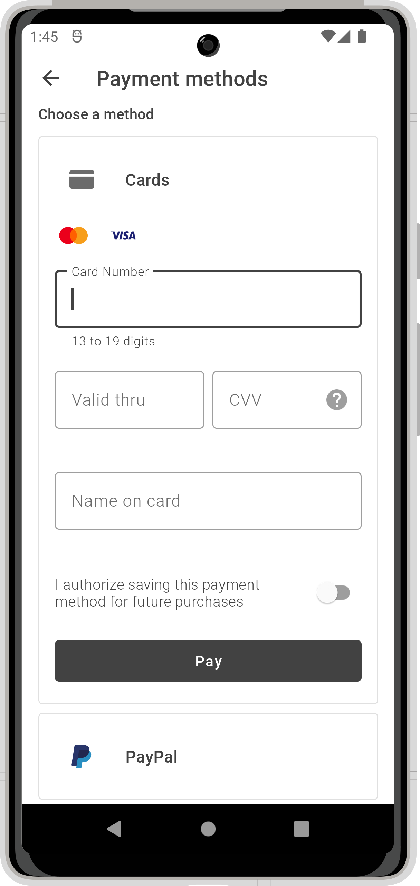

With Payoneer’s Checkout SDK for Android-based devices you can accept payments in your native shop app and provide a professional
checkout experience. The SDK takes care of the entire payment flow and handles all communication with the Open Payment Gateway (OPG) with
minimum effort from you and your team, and without requiring a high level of PCI-DSS compliance.

For information about integrating the Android Checkout SDK into your app, visit
the [documentation portal](https://orchestrationdocs.payoneer.com/docs/checkout-android-sdk).

